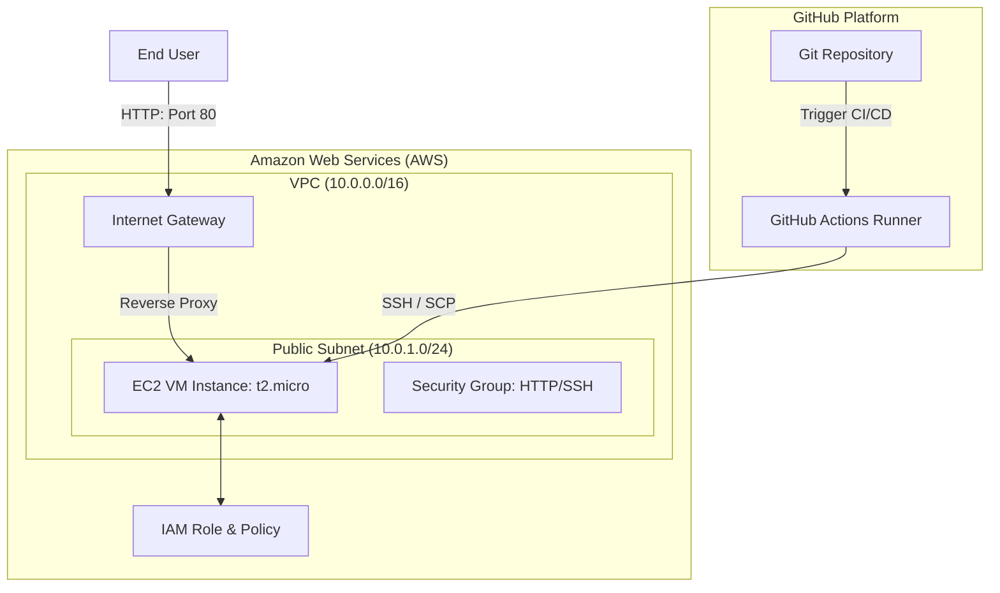

# Cloud Infrastructure & Application Deployment

This repository contains a complete solution for provisioning AWS infrastructure using **Terraform** and deploying a simple **Node.js Express application** on an EC2 instance via a **GitHub Actions CI/CD pipeline**.

---

## 🏗️ Architecture Diagram

The diagram below shows the end-to-end user request flow and deployment architecture:



### Request Flow
1. **User Request:** The client sends an HTTP request to the EC2 Public IP on Port 80.
2. **Security Group:** The Security Group filters traffic, only allowing TCP traffic on ports 80 (HTTP), 3000 (direct App), and 22 (SSH).
3. **Nginx Reverse Proxy:** Nginx acts as a reverse proxy on the EC2 instance, listening on Port 80 and routing internal requests to the Node.js application running on Port 3000.
4. **App Execution:** The Node.js Express application runs in the background managed by **PM2** under the `ubuntu` user context.

---

## 🛠️ Tech Stack & Setup

### Components
1. **Application:** Node.js Express server running on port 3000 (with testing via Jest + Supertest).
2. **Infrastructure:** Terraform code targeting AWS.
3. **CI/CD:** GitHub Actions for automated linting, unit testing, and deployment.

### Local Setup & Testing
To run the application locally:
```bash
cd app
npm install
npm test      # Runs tests
npm start     # Runs app on http://localhost:3000
```

---

## ⚙️ Deployment Instructions

### 1. Provisioning Infrastructure (Terraform)
Navigate to the `terraform/` directory and run:
```bash
cd terraform
terraform init
terraform plan
terraform apply
```
*Note: Make sure to configure your AWS CLI credentials locally (`aws configure`) before running Terraform.*

### 2. Configuring CI/CD Secrets in GitHub
To enable the GitHub Actions deployment pipeline, add the following secrets under **Settings > Secrets and variables > Actions** in your Git repository:

| Secret Name | Description |
| :--- | :--- |
| `EC2_HOST` | The public IP of the EC2 instance (outputted by Terraform as `instance_public_ip`). |
| `EC2_SSH_KEY` | The private SSH key used to access the EC2 instance (corresponding to `var.key_name`). |
| `AWS_ACCESS_KEY_ID` | Your AWS IAM User access key ID. |
| `AWS_SECRET_ACCESS_KEY` | Your AWS IAM User secret access key. |

Once these secrets are set, any push to the `main` branch will automatically run tests and deploy the updated application code to the EC2 instance.

---

## 💡 Design Decisions

1. **VPC Custom Setup:** Rather than using the default AWS VPC, we provision a custom VPC with a single public subnet. This provides isolated networking, custom IP ranges, and full control over route tables.
2. **Nginx Reverse Proxy:** Instead of binding our Node.js app directly to Port 80 (which requires root/sudo access), we configure **Nginx** to listen on Port 80 and reverse-proxy requests to Node.js on Port 3000. This is standard production best practice, improving security and performance.
3. **Process Management via PM2:** PM2 is utilized to keep the Node.js process alive. It handles automatic restarts if the app crashes, systemd startup configuration to survive VM reboots, and zero-downtime reloads (`pm2 reload`) during CI/CD.
4. **IAM Role Attachment:** The EC2 instance is attached to an IAM Instance Profile granting access to the `AmazonSSMManagedInstanceCore` policy. This allows secure, passwordless console access via AWS Systems Manager Session Manager, removing the absolute requirement for open SSH ports.

---

## ⚖️ Trade-offs Considered

### Single VM vs. Container Orchestrator (ECS / EKS)
* **Decision:** We deployed to a single EC2 instance rather than ECS Fargate or EKS.
* **Trade-off:** While ECS/EKS provides auto-scaling, high availability, and built-in load balancing, a single EC2 instance is significantly cheaper ($0 under AWS Free Tier) and fits the requirement for a "simple application." For small workloads, the operational complexity and cost of ECS/EKS are not justified.

### SSH Deployment vs. AWS CodeDeploy / Docker Registry
* **Decision:** We used GitHub Actions to push code over SSH/SCP and reload PM2.
* **Trade-off:** Building and pushing a Docker image to AWS ECR, then pulling it on the VM, is cleaner for containerization. However, it requires managing container registries and ECR auth tokens in GitHub, adding overhead. SCP/SSH deployment is simpler, faster to execute, and highly transparent for reviewers.

### Public Subnet vs. NAT Gateway / Private Subnet
* **Decision:** The EC2 instance is placed directly in a Public Subnet with a public IP.
* **Trade-off:** In a enterprise production environment, VMs run in private subnets behind an Application Load Balancer (ALB), using NAT Gateways for outbound traffic. To stay within the Free Tier and avoid NAT Gateway charges (~$32+/month), we used a public subnet and secured the VM using strict Security Group rules.

---

## 💵 Cost Awareness

The infrastructure is designed to fit entirely within the **AWS Free Tier** to ensure the deployment costs $0/month:

* **EC2:** Uses a `t2.micro` (or `t3.micro` depending on region) which is free for 750 hours/month (12 months for new accounts).
* **Storage:** 8 GB General Purpose SSD (gp3) volume is free under the 30 GB EBS Free Tier.
* **Networking:** 1 public IPv4 address is assigned. *Note: AWS charges a small fee ($0.005/hour) for public IPv4 addresses, which totals ~$3.60/month if active 24/7, but remains free under the public IP allowance for new accounts in some regions.*
* **Data Transfer:** 100 GB of egress data transfer per month is free.

### Clean-up Instructions
To tear down the infrastructure and avoid any charges, run:
```bash
cd terraform
terraform destroy
```
