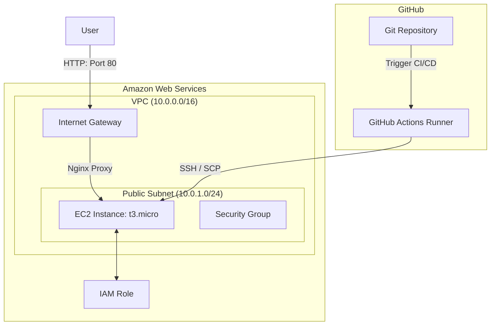

# Cloud Infrastructure and Application Deployment

This repository contains the source code and infrastructure configuration to deploy a Node.js Express application on AWS. The infrastructure is provisioned using Terraform, and the deployment is automated through a GitHub Actions CI/CD pipeline.

---

## Architecture Diagram

The diagram below outlines the system architecture and deployment flow:



### Request and Deployment Flow
1. **User Access:** Users access the application via HTTP on port 80. Traffic passes through the Internet Gateway to the EC2 instance.
2. **Reverse Proxy:** Nginx acts as a reverse proxy on the EC2 instance, forwarding requests from port 80 to the Node.js application running on port 3000.
3. **Application Layer:** The Node.js application is kept running in the background using PM2 under the standard user account.
4. **CI/CD Pipeline:** Developers push code to the repository. GitHub Actions runs automated tests and deploys the latest version to the EC2 instance over SSH and SCP.

---

## Tech Stack and Local Setup

### Core Components
* **Application:** Node.js, Express, Jest, Supertest
* **Infrastructure:** Terraform, AWS
* **CI/CD:** GitHub Actions

### Running Locally
To run the Node.js application locally:
```bash
cd app
npm install
npm test      # Runs unit tests
npm start     # Runs the local development server at http://localhost:3000
```

---

## Deployment Instructions

### 1. Provisioning AWS Resources
Navigate to the terraform directory to initialize and deploy:
```bash
cd terraform
terraform init
terraform plan
terraform apply
```
*Note: Make sure your AWS credentials are set up locally before running Terraform.*

### 2. GitHub Actions Secrets Configuration
To enable automatic deployments, configure the following secrets under **Settings > Secrets and variables > Actions** in your GitHub repository:

* **`EC2_HOST`**: The public IP address of the EC2 instance (provided as a Terraform output).
* **`EC2_SSH_KEY`**: The private key matching the key pair deployed on the instance.

Any push to the `main` branch will run the unit tests and automatically update the code on the EC2 instance.

---

## Design Decisions

1. **Custom VPC Networking:** A custom VPC and subnet configuration was used instead of default VPC resources. This ensures control over IP assignment, route tables, and firewall rules.
2. **Nginx Reverse Proxy:** Instead of running the Node.js application directly on port 80 (which requires root privileges), Nginx handles incoming port 80 traffic and forwards it to port 3000. This is more secure and aligns with production standards.
3. **PM2 Process Management:** PM2 is configured to manage the Node.js process. It handles automatic restarts in case of application failures and configures system startup scripts to survive VM reboots.
4. **IAM Instance Profile:** The EC2 instance is associated with an IAM role containing basic permissions. This includes the `AmazonSSMManagedInstanceCore` policy to enable secure management via Systems Manager (SSM) without relying on permanent credentials.

---

## Trade-offs Considered

### Single EC2 VM vs. Container Orchestration (ECS/EKS)
* **Decision:** A single EC2 virtual machine was selected.
* **Trade-off:** Container orchestrators like ECS or EKS provide better scalability and high availability, but they introduce higher complexity and pricing. For a basic application, a single EC2 instance is easier to deploy and cost-effective.

### SSH-Based Deployment vs. AWS CodeDeploy or Container Registry
* **Decision:** Deployment is handled via GitHub Actions using SSH/SCP.
* **Trade-off:** Deploying via Docker images pushed to ECR is clean and standard for large applications. However, setting up registries and authentication inside GitHub Actions adds complexity. Direct SSH deployment is simple, fast, and highly testable.

### Public Subnet vs. Private Subnet with NAT Gateway
* **Decision:** The EC2 instance is located in a public subnet.
* **Trade-off:** A private subnet with a NAT Gateway and Application Load Balancer is more secure. However, a NAT Gateway costs ~$32/month. To keep the project free to run under the AWS Free Tier, a public subnet secured with tight security group rules was selected.

---

## Cost Awareness

The resources used in this project are designed to stay within the **AWS Free Tier** limits ($0/month):

* **Compute:** 1 x `t3.micro` EC2 instance (750 hours/month free for new accounts).
* **Storage:** 8 GB General Purpose SSD (gp3) EBS volume (up to 30 GB free).
* **Networking:** 1 public IPv4 address and up to 100 GB of free internet data egress per month.

### Cleanup
To destroy all provisioned infrastructure and avoid costs:
```bash
cd terraform
terraform destroy
```
